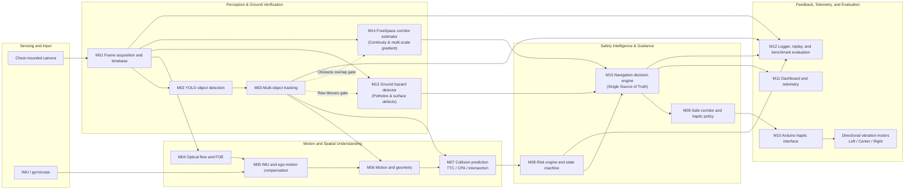

# SpatialVector-HMI System Architecture

SpatialVector-HMI is a local, camera-based assistive prototype that estimates whether observed motion may intersect the user's path, evaluates collision risk, verifies physical ground walkability, selects a safer corridor, and communicates guidance through directional haptics and voice.

The runtime flow is **Sense → Perceive → Understand → Predict → Decide → Assist**. The implementation is divided into modules M01–M15; this guide follows those module boundaries rather than presenting detection as a direct user command.

## Architecture Diagram

The standalone, editable Mermaid source is [`spatialvector_architecture.mmd`](spatialvector_architecture.mmd).



## Layer Responsibilities

### 1. Sensing and Input

The chest-mounted camera supplies timestamped frames to M01. An optional IMU/gyroscope supplies body-rotation measurements to M05. Camera and IMU data are time-sensitive: their timestamps allow the pipeline to reason about motion and expose stale or unavailable input.

### 2. Perception & Ground Verification

- **M01 — Frame acquisition and timebase:** Captures and validates frames, assigns timestamps, and handles camera reconnect behavior.
- **M02 — Object detection:** Runs YOLOv8 nano and produces class-labelled bounding boxes and confidence values.
- **M03 — Multi-object tracking:** Associates detections across frames, maintains track identity/history, applies temporal majority voting, and estimates image-space movement.
- **M13 — Ground hazard detector:** Identifies road and floor cavities (potholes, drops). Employs an honest fallback that suppresses alerts unless verified model weights (`pothole_yolov8.pt`) are loaded, and gates candidates against raw YOLO object detections and the ground horizon.
- **M14 — FreeSpace corridor estimator:** Verifies physical walkable surface in Left, Center, and Right corridors through bottom-up unbroken continuity scanning (from user's feet upward), multi-scale gradient jump checks ($k=10$, $>28\text{ px}$ span), and dark-blob / obstacle bounding box exclusion.

Detection answers what appears in a frame. Tracking adds temporal identity; ground verification confirms physical traversability; neither alone determines whether an object is on a collision course.

### 3. Motion and Spatial Understanding

- **M04 — Optical flow and FOE:** Estimates image motion and a focus-of-expansion cue from successive frames.
- **M05 — IMU and ego-motion compensation:** Reads gyroscope information and compensates for camera rotation where inputs are available. It exposes fallback/degraded conditions when compensation is unavailable or unreliable.
- **M06 — Motion and geometry:** Combines tracked-object state and motion cues to estimate bearing, normalized movement, and geometric relationships.
- **M07 — Collision prediction:** Evaluates time-to-collision (TTC), closest point of approach (CPA), trajectory intersection, and proximity evidence. TTC is a motion estimate, not a guarantee that a collision will occur.

### 4. Safety Intelligence & Guidance

- **M08 — Risk engine and state machine:** Combines prediction and geometry evidence into a risk score/state, with temporal hysteresis debouncing and explicit degraded behavior.
- **M15 — Navigation decision engine (Single Source of Truth):** Integrates obstacle collision risk (M08), ground hazards (M13), and corridor traversability (M14) into unified actionable guidance (`WALK FORWARD`, `MOVE LEFT`, `MOVE RIGHT`, `STOP`, `CAUTION`) with explicit human-readable reasons.
- **M09 — Safe corridor and haptic policy:** Translates guidance decisions into stabilized tactile directions (L/C/R) and calibrated vibration urgency levels (1–5).

The system preserves the distinction between a low-risk observation and missing or unverified data. A degraded or ambiguous state is never treated as safe.

### 5. Feedback, Telemetry, and Evaluation

- **M10 — Arduino haptic interface:** Sends the selected haptic command to the serial/Arduino output path. The firmware drives the directional vibration motors and includes a 500ms hardware watchdog.
- **M11 — Dashboard and telemetry:** Exposes pipeline state and telemetry over WebSocket for observation. The dashboard is not the safety decision-maker; safety decisions are computed on the local processing machine.
- **M12 — Logger, replay, and benchmark evaluation:** Records timestamped pipeline information for debugging, deterministic replay, and standardized ground-truth benchmark evaluation (`scripts/evaluate.py`).

Audio feedback is driven on-device via synthesized speech corresponding directly to the M15 guidance decision.

## End-to-End Data Flow

1. M01 acquires camera frames and maintains the frame timebase.
2. M02 detects objects; M03 tracks them across frames and exports raw bounding boxes.
3. M04 estimates optical flow/FOE, while M05 incorporates available IMU data and ego-motion compensation.
4. M06 derives motion and geometric cues; M07 evaluates potential path interaction using TTC, CPA, and intersection evidence.
5. M08 computes collision risk; M13 detects surface hazards; M14 affirmatively verifies ground walkability.
6. M15 resolves risk, hazards, and freespace into a single guidance decision with human-readable rationale.
7. M09 maps guidance to stabilized haptic patterns; M10 delivers commands to Arduino firmware and motors.
8. M11 streams live telemetry to the observer dashboard; M12 logs sessions for replay and offline benchmark evaluation.

## Important Signals

- **Bearing:** An object's horizontal position relative to the camera/user direction.
- **Relative motion:** Image/object movement over time, interpreted with camera motion where possible.
- **Time-to-collision (TTC):** An estimate based on relative motion and a collision condition; it becomes less reliable when motion estimates are weak.
- **Closest point of approach (CPA):** An estimate of the minimum separation of projected relative trajectories.
- **Risk state:** A policy-facing summary of multiple cues, not a direct restatement of object confidence.
- **Ground walkability:** Affirmative proof of continuous, unblocked terrain starting at the user's feet.
- **Corridor guidance:** Actionable directive from M15 backed by verified freespace and collision kinematics.

## Failure Handling and Safety Boundaries

Relevant degraded conditions include camera unavailability or stale frames, detector errors, lost tracks, insufficient motion history, unavailable or unreliable IMU data, low-confidence geometry, telemetry disconnection, unverified ground surface, and unavailable haptic hardware. These conditions remain visible as degraded/unknown state instead of being silently interpreted as a clear path.

### Safety Invariant
**"WALK FORWARD" strictly requires positive, unbroken confirmation of walkable ground.** If ground continuity cannot be affirmatively established (e.g. at a table edge, table corner, staircase ledge, or covered camera lens), the system immediately fails safe to `CAUTION` or `STOP`.

### Monocular Vision Limits
A 2D camera cannot resolve scale-free vertical drop depths (such as downward stairs or deep trenches) with 100% mathematical certainty. SpatialVector is designed to complement, never replace, the user's physical white cane or guide dog.

The dashboard is observational and can disconnect without impacting local safety decisions. The Arduino watchdog zeroes motor output if commands stall. SpatialVector is an assistive engineering prototype, not a certified medical mobility aid.

## Debugging Path

When a final direction or vibration seems wrong, trace the data upstream in order:

```text
Haptic command (M10)
  ← corridor and policy (M09)
  ← navigation decision engine (M15)
  ← collision risk (M08) / ground hazards (M13) / freespace continuity (M14)
  ← collision prediction (M07)
  ← motion and geometry (M06)
  ← ego-motion / optical flow (M05 / M04)
  ← tracked objects and raw boxes (M03)
  ← detections (M02)
  ← captured frame and timestamp (M01)
```

Use M12 logs and replay where available to reproduce the same inputs before changing thresholds or policy.

## Repository Mapping

| Responsibility | Implementation area |
|---|---|
| Camera source and detection/tracking | [`spatialvector/perception/`](../spatialvector/perception/) |
| Optical flow, IMU, ego-motion, and geometry | [`spatialvector/motion/`](../spatialvector/motion/) |
| Prediction, risk, and corridor policy | [`spatialvector/decision/`](../spatialvector/decision/) |
| Ground hazard detection (M13) | [`spatialvector/hazards/`](../spatialvector/hazards/) |
| FreeSpace and ground verification (M14) | [`spatialvector/freespace/`](../spatialvector/freespace/) |
| Navigation decision engine (M15) | [`spatialvector/guidance/`](../spatialvector/guidance/) |
| HMI, telemetry, and replay | [`spatialvector/hmi/`](../spatialvector/hmi/) |
| Arduino firmware | [`firmware/haptic_controller/`](../firmware/haptic_controller/) |
| Web dashboards | [`web/`](../web/) |
| Automated test suite | [`tests/`](../tests/) |
| Ground-truth benchmark suite | [`scripts/evaluate.py`](../scripts/evaluate.py) & [`tests/fixtures/real/`](../tests/fixtures/real/) |
| Model management and verification | [`models/`](../models/) |

For startup commands, module test commands, and live integration details, see the [root README](../README.md) and [Engineering Blueprint](../ENGINEERING_BLUEPRINT.md).
