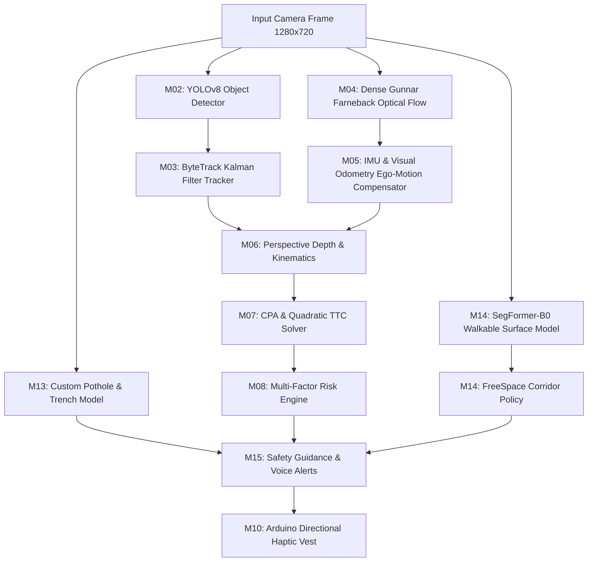

# SpatialVector-HMI: Mathematical, Algorithmic & Model Specifications

> **Official Engineering Reference Document**  
> **Nirmaan 2026 Hackathon · Healthcare & Assistive Tech Track**  
> *System Flow:* **Sense → Perceive → Understand → Predict → Decide → Assist**

This document provides a comprehensive technical and mathematical reference for the **SpatialVector-HMI** navigation engine. It details the machine learning models, geometric computer vision algorithms, kinematic equations, and state machine transitions implemented across the codebase.

---

## 1. Machine Learning & Deep Learning Model Architecture

SpatialVector-HMI deploys a multi-model edge perception pipeline combining lightweight Convolutional Neural Networks (CNNs), Vision Transformers (ViT), and Bayesian temporal state estimation.



### Model Inventory & Specifications

| Model / Subsystem | Architecture & Weights | Latency / Device | Primary Responsibility & Input/Output |
| :--- | :--- | :--- | :--- |
| **M02: Object Detector** | **YOLOv8 Nano** (`yolov8n.pt`) via Ultralytics | ~18ms (CPU / ONNX) | Detects dynamic obstacles (pedestrians, vehicles, bicycles, desks, obstacles) with 80 COCO classes. Output: `BBox(x1, y1, x2, y2), conf, class_id`. |
| **M13: Hazard Detector** | **Fine-Tuned YOLOv8** (`pothole_yolov8.pt`) + Heuristic Morphological Masking | ~22ms | Ground defect detection (potholes, open drains, manholes, puddles). Evaluates structural continuity in bottom 40% of the image frame. |
| **M14: FreeSpace Estimator** | **SegFormer-B0** (`nvidia/segformer-b0-finetuned-ade-512-512`) | ~24ms (224×224 tensor) | Vision Transformer for dense semantic segmentation of walkable terrain (ADE20K classes: floor, sidewalk, road, path) vs non-walkable boundaries (drop-offs, ledges, walls). |
| **M03: Multi-Object Tracker**| **ByteTrack** (Linear Kalman Filter + Hungarian matching) | < 2ms | Preserves persistent `track_id` identity across frame drops, smooths pixel velocity, and filters high-frequency jitter. |
| **M04: Optical Flow** | **Dense Gunnar Farnebäck** + **Shi-Tomasi Sparse Corners** | ~12ms | Pixel-level displacement field $(\Delta x, \Delta y)$ across consecutive frames to identify the Focus of Expansion (FOE). |
| **M05: Ego-Motion Compensator**| **IMU Fusion + Visual Odometry** (6-DOF gyro compensation) | < 1ms | Removes the wearer's physical walking sway and head bobbing from raw visual velocities. |

---

## 2. Monocular Ground-Plane Distance & Camera Geometry

* **Implementation:** [`spatialvector/hazards/ground_hazard.py`](../spatialvector/hazards/ground_hazard.py) (Lines 14–22) and [`spatialvector/decision/prediction.py`](../spatialvector/decision/prediction.py) (Lines 168–178)

Single-camera systems cannot measure metric depth directly without geometric assumptions. SpatialVector-HMI utilizes the flat ground-plane perspective projection model.

```
       Camera (Height = h_cam, Pitch = θ_pitch)
          \
           \
            \  Line of Sight
             \
  ────────────\────────────── Ground Plane (y = 0)
              [ Obstacle ]
              ◄──────────►
                Distance (d)
```

### Ground Distance Formulation ($d_{\text{ground}}$)
Let:
* $h_{\text{cam}}$ = Camera height from ground (meters, default: $1.25\text{ m}$)
* $\theta_{\text{pitch}}$ = Camera downward tilt angle (radians)
* $f_{\text{px}} = \alpha \cdot W_{\text{frame}}$ = Camera focal length in pixels ($\alpha \approx 1.1$)
* $v_{\text{bottom}}$ = Bottom edge row coordinate of the obstacle bounding box
* $v_{\text{horizon}} = H_{\text{frame}} \cdot (0.5 - \tan(\theta_{\text{pitch}}))$ = Calculated optical horizon row

The calibrated ground distance $d$ is given by:
```
                h_cam · f_px
d_ground = ──────────────────────────
           max(1, v_bottom - v_horizon)
```

### Normalized Proximity Metric
For obstacles above the ground plane, distance is computed via the bounding box height fraction ($s = \frac{h_{\text{bbox}}}{H_{\text{frame}}}$):
```
y_rel = clip(0.35 / s, 0.15, 2.50)
```

---

## 3. Kinematic Vector Setup & Ego-Motion Decoupling

* **Implementation:** [`spatialvector/motion/ego_motion.py`](../spatialvector/motion/ego_motion.py) and [`spatialvector/decision/prediction.py`](../spatialvector/decision/prediction.py) (Lines 180–205)

The user is positioned at origin $(0, 0)$. True motion is isolated by subtracting the wearer’s rotational and translational ego-motion:

```
v_rel = v_observed - v_ego
```

* **Relative Position Vector:**
  ```
  r = [ x_rel,  y_rel ]
  ```
  where $x_{\text{rel}} = \sin(\text{bearing})$ and $y_{\text{rel}} = d_{\text{estimated}}$.

* **Relative Velocity Vector:**
  ```
  v = [ v_x,  -v_approach ]
  ```
  where $v_x$ is lateral image drift, and $v_{\text{approach}}$ is the forward approach speed.

---

## 4. Closest Point of Approach (CPA)

* **Implementation:** [`spatialvector/decision/prediction.py`](../spatialvector/decision/prediction.py) (Lines 360–373)

The Closest Point of Approach determines the spatial separation between user and obstacle at the moment of nearest encounter.

```
Position at time t:  p(t) = r + v · t
Squared Distance:    D(t)² = |r + v · t|² = (r + v · t) · (r + v · t)
```

Setting the first derivative to zero:
```
d/dt [ D(t)² ] = 2 · v · (r + v · t) = 0
2 · (r · v + |v|² · t) = 0
```

Solving for $t_{\text{cpa}}$:
```
           r · v             x_rel · v_x + y_rel · v_y
t_cpa = - ──────── = - ─────────────────────────────────────
           |v|²                  v_x² + v_y²
```

### Physical Constraints & Velocity Guard
1. **Zero Relative Velocity Guard:** If $|v|² < 10^{-6}$, the object is co-moving or static $\implies t_{\text{cpa}} = \text{None}$, $d_{\text{cpa}} = \|r\|$.
2. **Receding Path Check:**
   * If $t_{\text{cpa}} \le 0$: The closest point occurred in the past; the object is moving **away** from the user $\implies \text{Collision Risk} = 0$.
   * If $t_{\text{cpa}} > 0$: The object is approaching in future time $\implies$ proceed to intersection & TTC analysis.

### Minimum Separation Distance ($d_{\text{cpa}}$)
```
d_cpa = |r + v · t_cpa| = √[ (x_rel + v_x · t_cpa)² + (y_rel + v_y · t_cpa)² ]
```

---

## 5. Quadratic Contact Envelope & Time-To-Collision (TTC)

* **Implementation:** [`spatialvector/decision/prediction.py`](../spatialvector/decision/prediction.py) (Lines 374–429)

### 5.1 Corridor Intersection Criteria
An obstacle is flagged with `intersection_flag = True` if and only if both conditions hold:
```
Condition 1 (Spatial):  d_cpa < Corridor_Width      (default: 0.12 normalized units)
Condition 2 (Temporal): t_cpa ≤ Time_Horizon        (default: 5.0 seconds)
```

### 5.2 The Contact Envelope Quadratic Solver
Collision does not require touching $(0,0)$; contact occurs when relative distance drops below the user protective safety radius $R_{\text{contact}} = 0.05$:

```
|r + v · t|² = R_contact²
```

Expanding into standard quadratic form $a \cdot t² + b \cdot t + c = 0$:
```
a = |v|² = v_x² + v_y²
b = 2 · (r · v) = 2 · (x_rel · v_x + y_rel · v_y)
c = |r|² - R_contact² = (x_rel² + y_rel²) - 0.05²
```

The discriminant evaluates trajectory proximity:
```
Δ = b² - 4 · a · c
```

```
TTC = min { t > 0  |  t = (-b - √Δ) / (2 · a) }
```
* If $\Delta < 0$: Trajectory misses the contact radius completely ($TTC = \text{None}$).
* If $\Delta \ge 0$: The smaller positive root represents the first instant of contact.

### 5.3 Head-On Looming Expansion Fallback
For obstacles moving directly along the optical line of sight, lateral motion $v_x \approx 0$. The system computes Time-To-Collision from the biological visual looming equation:

```
                  s(t)                    1
TTC_looming = ────────────── = ───────────────────────
               ds(t) / dt       Relative Expansion Rate
```
where $s(t)$ is the detected bounding box vertical scale and $\dot{s}(t)$ is its temporal expansion rate.

---

## 6. Multi-Factor Risk Engine (M08)

* **Implementation:** [`spatialvector/decision/risk_engine.py`](../spatialvector/decision/risk_engine.py) (Lines 350–405)
* **Configuration:** [`spatialvector/config/default.yaml`](../spatialvector/config/default.yaml)

Risk is evaluated purely through geometry and dynamics. Class labels do not influence risk scores.

```
Risk_i = (w_ttc · S_ttc) + (w_miss · S_miss) + (w_int · S_int)
```

### Weight Distribution & Mathematical Terms

| Component | Default Weight | Mathematical Formula | Physical Significance |
| :--- | :---: | :--- | :--- |
| **Temporal Urgency ($S_{\text{ttc}}$)** | **0.50** | $\operatorname{clip}\left(1.0 - \frac{\text{TTC}}{T_{\text{horizon}}},\, 0,\, 1\right)$ | Inversely proportional to remaining reaction time. 0s TTC produces maximum urgency 1.0. |
| **Spatial Proximity ($S_{\text{miss}}$)** | **0.30** | $\operatorname{clip}\left(1.0 - \frac{d_{\text{cpa}}}{0.50},\, 0,\, 1\right)$ | Proportional to closest approach distance. Direct center collision produces 1.0. |
| **Trajectory Confidence ($S_{\text{int}}$)** | **0.20** | $\begin{cases} C_{\text{pred}} & \text{if Intersection is True} \\ 0 & \text{otherwise} \end{cases}$ | Scales risk with multi-frame Kalman tracking confidence $C_{\text{pred}} \in [0, 1]$. |

### Static Proximity Safety Override
For stationary obstacles directly ahead where velocity is near zero:
```
If in Center Corridor and BBox Scale > 0.22:
    Proximity_Risk = clip( (BBox_Scale - 0.17) / 0.45, 0.0, 1.0 )
    Risk_i = max( Risk_i, Proximity_Risk )
```

---

## 7. Global Risk & 3-Corridor Spatial Allocation

* **Implementation:** [`spatialvector/decision/risk_engine.py`](../spatialvector/decision/risk_engine.py) (Lines 304–320, 407–439)

### Global Risk Aggregation
To prevent safe background objects from diluting a critical hazard:
```
Global_Risk = max( Risk_1, Risk_2, ..., Risk_n )
```

### Tri-Corridor Field of View Allocation
The camera view is partitioned into Left, Center, and Right corridors based on bearing angle ($\theta$):

```
       LEFT CORRIDOR       │     CENTER CORRIDOR      │      RIGHT CORRIDOR
   θ < -30° (-0.52 rad)    │   -30° ≤ θ ≤ +30°        │    θ > +30° (+0.52 rad)
```

### Corridor Risk Aggregation
For each corridor, hazards are aggregated using a primary-plus-secondary formulation:
```
Corridor_Risk = clip( Risk_primary + 0.5 · ∑ Risk_secondary,  0.0,  1.0 )
```
This ensures a corridor with multiple moderate hazards evaluates as less safe than a clear path.

---

## 8. Hysteresis Filtering & State Transition Machine

* **Implementation:** [`spatialvector/decision/risk_engine.py`](../spatialvector/decision/risk_engine.py) (Lines 480–525)

To eliminate rapid vibration chattering and audio alert flutter, state transitions enforce asymmetric temporal debouncing.

```
                  Risk ≥ 0.30 (3 frames)            Risk ≥ 0.60 (3 frames)            Risk ≥ 0.85 (3 frames)
        ┌───────┐                         ┌─────────┐                         ┌──────────┐
        │ SAFE  │ ──────────────────────► │ CAUTION │ ──────────────────────► │ CRITICAL │
        │       │ ◄────────────────────── │         │ ◄────────────────────── │          │
        └───────┘  Risk < 0.30 (5 frames) └─────────┘  Risk < 0.60 (5 frames) └──────────┘
```

### State Machine Transition Rules

| State | Risk Interval | Escalation Delay | De-escalation Delay | Haptic / Voice Output |
| :--- | :---: | :---: | :---: | :--- |
| **SAFE** | $[0.00,\, 0.30)$ | — | 5 consecutive frames | Motors OFF / Silent |
| **CAUTION** | $[0.30,\, 0.60)$ | 3 consecutive frames | 5 consecutive frames | Low-frequency single directional pulse |
| **WARNING** | $[0.60,\, 0.85)$ | 3 consecutive frames | 5 consecutive frames | Medium double pulse + Voice guidance |
| **CRITICAL** | $[0.85,\, 1.00]$ | 3 consecutive frames | 5 consecutive frames | Continuous high-frequency vibration + Immediate safety cue |
| **DEGRADED** | System Conf $< 0.25$ | 1 frame (immediate) | Cleared on sensor recovery | Periodic system health warning pulse |

---

## 9. FreeSpace Walkability & Ground Continuity (M14)

* **Implementation:** [`spatialvector/freespace/corridor_estimator.py`](../spatialvector/freespace/corridor_estimator.py) (Lines 55–120)

Walkability is scored using an empirical regression combining SegFormer semantic segmentation and edge drop-off filters:

```
Walkability_Confidence = σ( w_0 + w_1 · Margin_ground + w_2 · P_mean + w_3 · C_agreement )
```
where:
* $\text{Margin}_{\text{ground}}$ = Fraction of pixels identified as walkable ground minus the threshold ($0.55$).
* $P_{\text{mean}}$ = Mean softmax probability over all ground-class pixels.
* $C_{\text{agreement}}$ = Binary cross-check between SegFormer semantic ground and Sobel vertical drop-off edge detectors.
* $\sigma(x)$ = Calibrated sigmoid function scaling confidence to $[0.0, 1.0]$.
